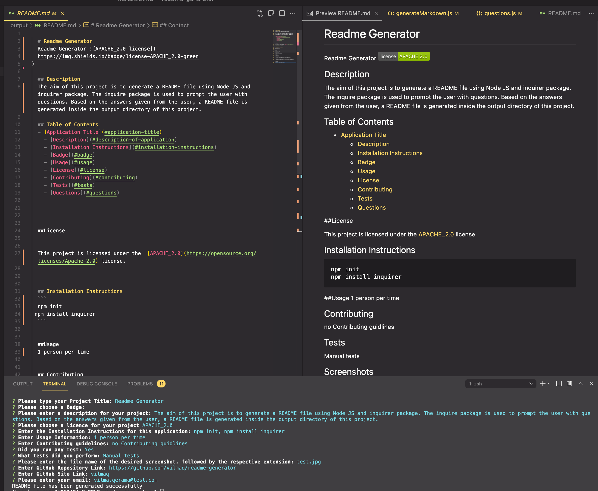

# README GENERATOR

## Description

The aim of this project is to generate a README file using Node JS and inquirer package. The inquire package is used to prompt the user with questions. Based on the answers given from the user, a README file is generated inside the output directory of this project.

The Project contains the file questions.js where the questions to ask to the user are; createFile.js - that creates the README file in the output folder and generateMarkdown.js that generates the markdown based on the answers given to the questions.

## Table of Contents

- [README GENERATOR](#readme-generator)
  - [Description](#description)
  - [Table of Contents](#table-of-contents)
  - [Installation Instructions](#installation-instructions)
  - [Tests](#tests)
  - [Screenshots](#screenshots)
  - [Github](#github)

## Installation Instructions

```
npm init
npm install inquirer
```

## Tests

Manual tests have been performed for this project

## Screenshots



## Github

- [Github Project Repository](https://github.com/vilmaq/readme-generator)
- [Github Project URL](vilmaq)
